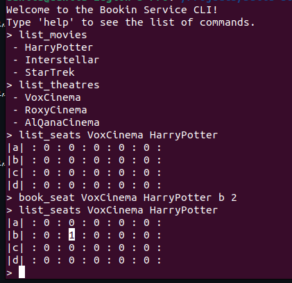
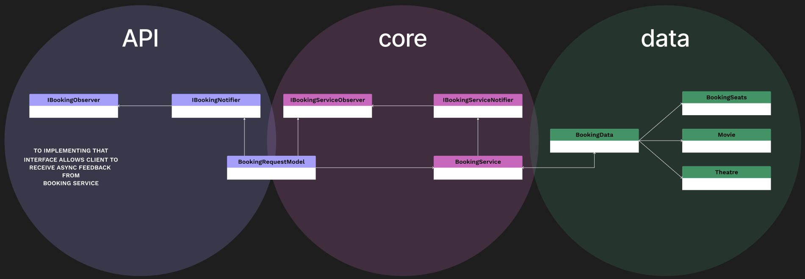

# Booking Service

Sample project to provide seat booking in theatres. 

## Table of contents
* [General info](#general-info)
* [Main functions](#main-functions)
* [How to use](#how-to-use)
* [Instructions](#instructions)
* [Doc generator](#doc-generator)
* [Project diagram](#project-diagram)
* [Project structure](#project-structure)
* [Dependencies](#dependencies)

## GENERAL INFO

Cross-platform solution of booking service. Source code is the implementation of a backend service in C++ which is used by some other services (CLI or other User Interface) for booking online movie tickets.

## MAIN FUNCTIONS

* View all playing movies
* Select a movie
* See all theaters showing the movie
* Select a theater
* See available seats (e.g., a1, a2, a3) for the selected theater & movie.
* Book one or more of the available seats.
* Multiple requests simultaneously (no over-bookings).

## HOW TO USE
1. Run first time application.
2. Close application
3. It will create files like database in json format in "static" folder: theatres.json, movies.json and booking_seats.json
4. Modify theatres.json like: "Name" is name of theatre. "Row" is name of row like "a, b, c, d" and total number of seats.\
IMPORTANT: only 4 rows supported with names "a", "b", "c" and "d"!\
P.S.: It is possible to copy files from src/sample folder and put it in build/static folder.

> [\
>   {\
>     "Name":"VoxCinema",\
>     "Row":{"a":5, "b": 5, "c": 5, "d": 5}\
>   }, \
>   {\
>     "Name":"RoxyCinema",\
>     "Row":{"a":5, "b": 5, "c": 5, "d": 5}\
>   },\
>   {\
>     "Name":"AlQanaCinema",\
>     "Row":{"a":5, "b": 5, "c": 5, "d": 5}\
>   }\
> ]

5. Modify movies.json like: "Name" is name of movie. "Theatres" array is name of cinemas where the movie is going.\
P.S.: It is possible to copy files from src/sample folder and put it in build/static folder.

> [\
> {"Name": "HarryPotter", "Theatres":["VoxCinema"]},\
> {"Name": "Interstellar", "Theatres":["VoxCinema", "AlQanaCinema"]},\
> {"Name": "StarTrek", "Theatres":["VoxCinema", "AlQanaCinema", "RoxyCinema"]}\
> ]

6. Run the application.
7. Example of using:

   

## INSTRUCTIONS

### Linux 

1. Clone the repository and update submodules in local folder (using SSH or http)
  > git clone git@github.com:danila-pavalotski/booking_service.git\
  > git submodule update --init --recursive

2. If needed install cmake tools
> sudo apt install cmake

3. Go to folder with repository and make the project
> mkdir build
> cd build
> cmake ..
> make

4. Go to folder build/bin and run the application
> ./BookingSericeTest

### Windows 

1. Clone the repository and update submodules in local folder (using SSH or http)
  > git clone git@github.com:danila-pavalotski/booking_service.git\
  > git submodule update --init --recursive

2. Install Cmake
  > https://cmake.org/download/

3. Install Visual Studio Build Tools
4. Open cmd or Power Shell and go to the folder with project
5. Compile the project through command line
  > cmake -G "Visual Studio 17 2022" -A Win32 -B "build32"\
  > cmake -G "Visual Studio 17 2022" -A x64 -B "build64"\
  > cmake --build build32 --config Release\
  > cmake --build build64 --config Release

## DOC GENERATOR

1. In "src" folder there is Doxyfile file
2. To generate docs following commands must be used:
   > cd src/\
   > doxygen Doxyfile
3. Generated doc files will be in "docs/html" folder. 

## PROJECT DIAGRAM

## PROJECT STRUCTURE
    .
    ├── 3rdparty                                        # External libraries (git submodules)
    │   ├──
    │   ├──
    │   └── CMakeLists.txt                      
    ├── src                                             # Source code 
    │   ├─────────── API                                # Classes that provide API 
    │   │            ├── 
    │   │            ├──
    │   │            └──
    │   ├─────────── core                               # Source code of booking service
    │   │            ├──
    │   │            ├──
    │   │            └──
    │   ├─────────── data                               # Classes to load/save data on disk
    │   │            ├──
    │   │            ├──
    │   │            └──
    │   ├─────────── docs                               # Generated documentation by Doxygen
    │   └── CMakeLists.txt
    ├── test                                            # test CLI application
    ├── tests                                           # Unit tests with googletest framework
    └── README.md
    
    0...1............2............3                     # LEVEL

## DEPENDENCIES
* CMake 3.16 and higher
* Visual Studio Build Tools (For Windows users)
